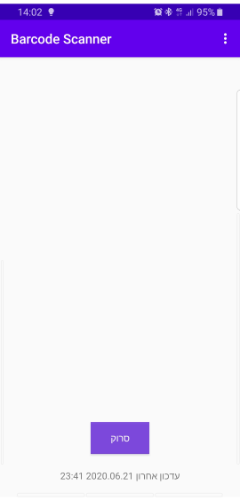
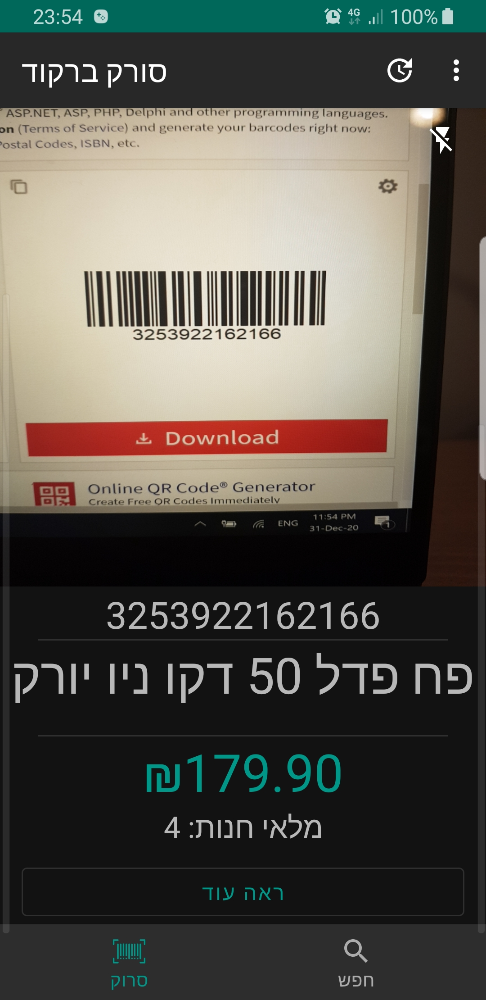
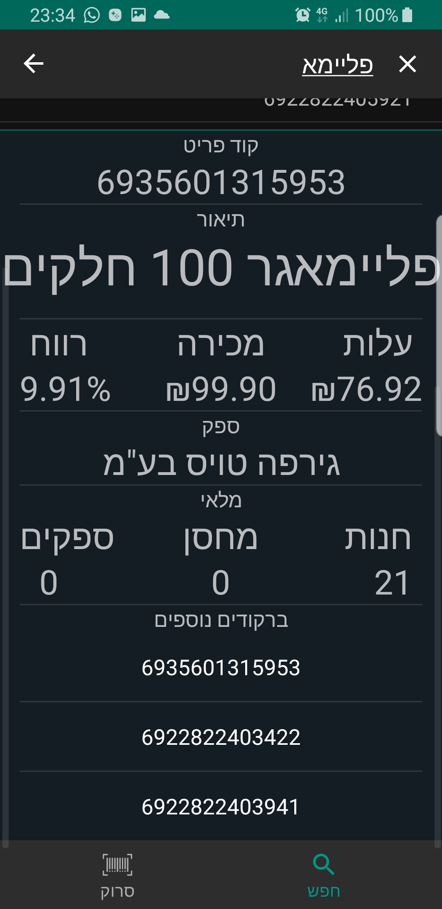

Barcode Scanner
=================

Android app to retrieve retail data of an item by scanning an item barcode.

This app uses the following libraries 
* [Google ML Kit APIs](https://developers.google.com/ml-kit)  Barcode API to detect barcodes in live camera.
* [Google Firebase](https://firebase.google.com/docs) to store and get data.

Screenshots
-----------
![Home]
![Scan Barcode]
![Item Info]

